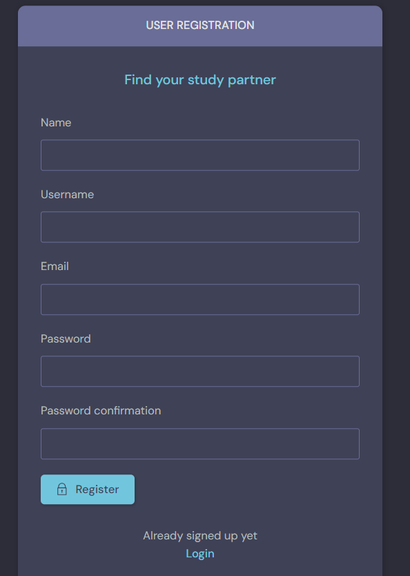
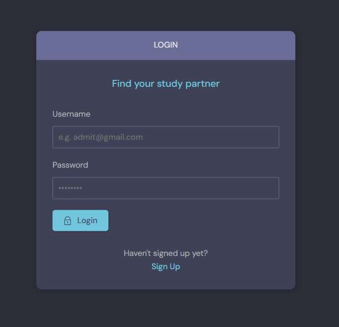
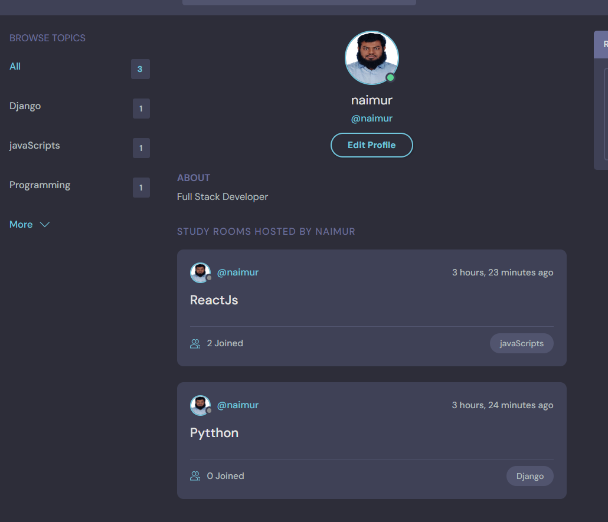
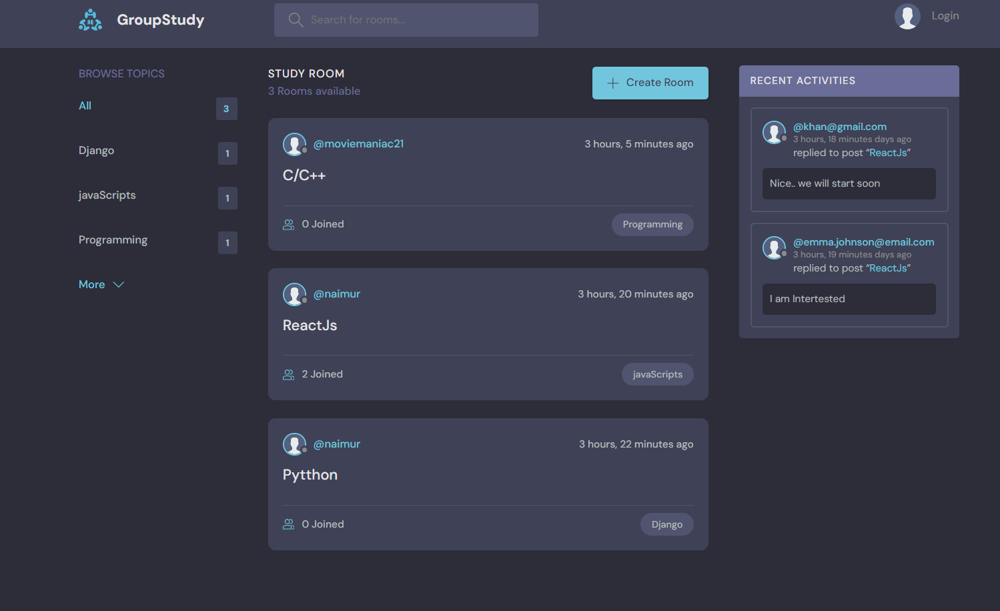
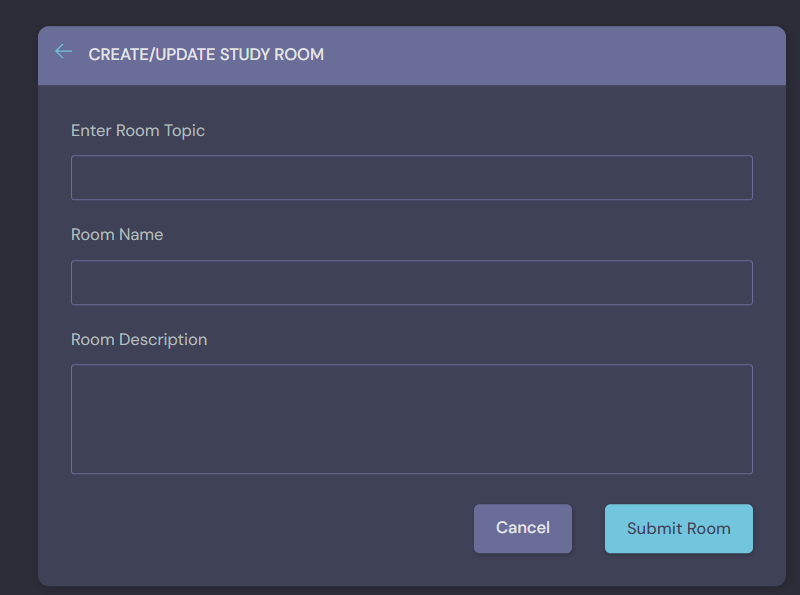
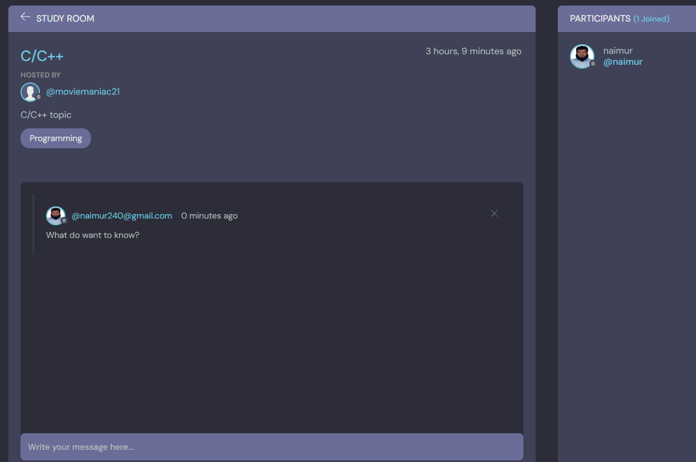

# Study and group meeting share -Apps

*Python-Django Based Apps*

## Description

The *Study and group meeting share* is an online platform dedicated to communication and sharing Opinions and Thoughts Based On Topic. 

## Features 
1. User Authentication 
2. Profile Update
3. New Chat Room Create and Participate on the topic
4. Discussion and Reply and Comment
5. Quick Search & Recent Activitie


### Product Catalog

- **User Authentication:** User can create an account and loggedIn.

* Sign Up Form *


* LogIn Form *



- **Home Page:** Can See all  Post and Topic




- **Individual Topic and  Posting :** 



- **Comment and Reply Option:** 




## Getting Started

1. Clone this repository to your local machine.
2. Create a virtual environment using `virtualenv`: 
virtualenv venv
3. Activate the virtual environment:

- On Windows:

  ```
  venv\Scripts\activate
  ```

- On macOS and Linux:

  ```
  source venv/bin/activate
  ```

4. Install project dependencies using pip: 
pip install -r requirements.txt
5. Configure the project settings in `settings.py`, including database settings and secret key.

6. Apply migrations to create the database:
python manage.py migrate

7. Run the development server:
python manage.py runserver


8. Access the project in your web browser at `http://localhost:8000/`.


## Contributing

We welcome contributions! If you'd like to contribute to this project, please follow our [contribution guidelines](CONTRIBUTING.md).


## Author

- Md Naimur Rahman

## Acknowledgments

- We'd like to thank the Django community for their fantastic framework.
- Special Thanks Dennis Ivy Youtube Instructor [Dennis Ivy](https://www.youtube.com/@DennisIvy) 


## Contact

If you have any questions or feedback, please contact us at [naimur240@gmail.com](mailto:naimur240@gmail.com).